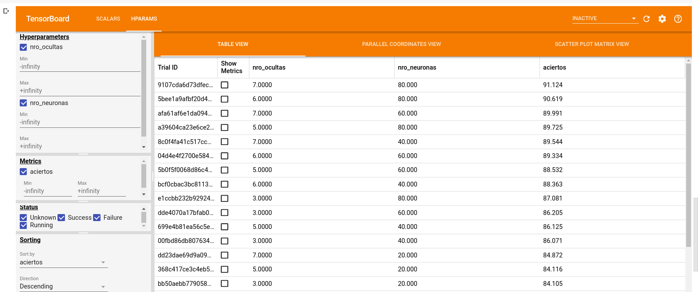
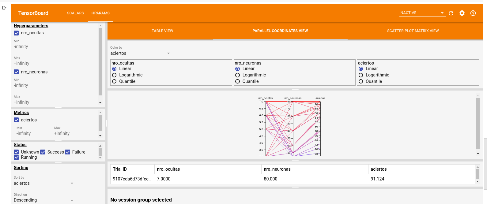

```{r setup, include=FALSE}
knitr::opts_chunk$set(echo = TRUE)
library(readr)
library(tidyverse)
library(caret)
library(keras)
```


## Construcción del modelo

Para crear el modelo predictivo basado en redes neuronales se ha empleado Tensorflow/Keras, estas librerías pueden usarse tanto desde R como desde Python.

### Arquitectura
La arquitectura que se propone es muy sencilla, y se consideran hiperparámentros de la arquitectura :

* el número de capas ocultas
* la cantidad de neuronas por capa

De esta manera, la arquitectura es plana en cuanto a la distribución de neruonas en las capas. Se desea explorar por medio de hiperparámetros qué configuración logra predecir mejor la calidad del vino.

El problema se plantea como una regresión, aunque los niveles observados en los datos son claramente valores de 1 al 5, éstos son cuantitativos y establecen una relación de distancia. 

### Preprocesamiento de los datos

No se observaron datos faltantes o iregularidades en los mismos. Solamente se procedió a escalar los valores, para que los rangos diferentes en las variables no afecten la distribución de pesos en la red.

### Modelo de Red Neuronal

Se realizó a través de un código en [Colab](https://colab.research.google.com/drive/1M7AaGbzexX4CetPu2NJNxQ9L8ONPAKiD), allí se desarrolló un modelo de red en Python con Keras que admitía los parámetros anteriormente mencionados. En esta etapa no se deseaba optimizar los parámetros como el optimizador, learning rates o regularizaciones. Simplemente se deseaba encontrar la arquitectura que mejor resuelva el problema dados los parámetros por defecto del optimizador Adam.

El objetivo a optimizar, es una métrica desarrollada para este problema, que mide el porcentaje de aciertos en predicciones luego de haber redondeado la salida de la red. Si se intentara sumar una capa a la red que haga ese redondeo, se crearía una superficie de error no diferenciable, que podría imposibilitar al algoritmo encontrar el mínimo.

Al ser una regresión se optó por una función de error MSE (Mean Squared Error) y una salida con una capa densa con activación lineal.


```{python eval=FALSE}
def aciertos(y_true, y_pred):
  real = tf.dtypes.cast(y_true, tf.int32)
  predicho = tf.dtypes.cast(tf.math.round(y_pred), tf.int32)
  diferencia_abs = tf.math.abs(real - predicho)
  igual = tf.math.reduce_sum(tf.dtypes.cast(diferencia_abs == 0,tf.int32 ))
  return (igual) * 100 / tf.size(diferencia_abs)

class CalidadDeVinoModelo(Model):
    def __init__(self, nr_ocultas=5, nro_neuronas=32):
        '''
            Configurando las variables del modelo
        '''
        super(CalidadDeVinoModelo, self).__init__()
        self.nr_ocultas = nr_ocultas
        self.nro_neuronas = nro_neuronas
        self.ocultas = []
        for capa in range(1, nr_ocultas): 
          if(capa == 1):
            self.ocultas.append(Dense(nro_neuronas, activation='relu', input_shape=(12,)))
          else:
            self.ocultas.append(Dense(nro_neuronas, activation='relu'))
        self.salida = Dense(1)
        self.compile(
            optimizer = 'adam',
            loss = 'mse',
            metrics = [aciertos]
        )
```

### Evaluación de la performance del modelo

Cada configuración es evaluada utilizando K-Fold cross validation, con K=5. De esta manera se mejora la estimación del poder predictivo del modelo, y se limitan las evaluaciones incorrectas debido a la semilla aleatoria utilizada.


```{python eval=FALSE}
def train_test_model(hparams):
  nro_ocultas = hparams[HP_NRO_OCULTAS]
  nro_neuronas = hparams[HP_NRO_NEURONAS]
  aciertos_list = []
  for j, (train_idx, val_idx) in enumerate(folds):
    X_train_cv = X_train[train_idx]
    y_train_cv = y_train.values[train_idx]
    X_valid_cv = X_train[val_idx]
    y_valid_cv= y_train.values[val_idx]
    

    modelo = CalidadDeVinoModelo(nr_ocultas=nro_ocultas, nro_neuronas=nro_neuronas)
    batch_size = 64
    modelo.entrenar(
        x = X_train_cv,
        y = y_train_cv,
        steps_per_epoch=len(X_train_cv)/batch_size,
        validation_data = (X_valid_cv, y_valid_cv),
        epocas=500,
        verbose=0,
    )
    aciertos_j = modelo.evaluate(X_valid_cv, y_valid_cv, verbose=0)[-1]
    aciertos_list.append(aciertos_j)
  media_aciertos = np.average(aciertos_list)
  return media_aciertos

```

### Optimización de hiperparámetros

Se ha realizado un grid search sobre configuraciones posibles, con el fin de obtener una aproximación de los límites para ambos parámetros

```{python eval=FALSE}
# grid search
HP_NRO_OCULTAS = hp.HParam('nro_ocultas',  hp.Discrete([3, 5, 7 ]))
HP_NRO_NEURONAS = hp.HParam('nro_neuronas', hp.Discrete([100, 200, 400]))

for nro_ocultas in HP_NRO_OCULTAS.domain.values:
  for nro_neuronas in HP_NRO_NEURONAS.domain.values:
    hparams = {
      HP_NRO_OCULTAS: nro_ocultas,
      HP_NRO_NEURONAS: nro_neuronas
      
    }
    aciertos_list = []
    parametros = ({h.name: hparams[h] for h in hparams})
    ejecucion_nombre = '-'.join(['{}_{}'.format(k,v) for k,v in parametros.items()])
    start = timer()
    media_aciertos = run('logs/hparam_tuning/' + ejecucion_nombre, hparams)
    end = timer()
    print('media_aciertos: ', media_aciertos, 'nro_ocultas: ', nro_ocultas, 'nro_neuronas: ', nro_neuronas, 'tiempo: ', end-start) 
```


Se guardan la métrica a observar en la carpetas logs y se emplea [Tensorboard](https://www.tensorflow.org/tensorboard) para visualizar y ordenar las salidas de las métricas durante el entrenamiento





> Se resalta en este caso la configuración que ha tenido mejor performance en esta corrida.


## Evaluación de la capacidad de generalizar del modelo.

Con el procedimiento anterior, se tiene una buena estimación de la capacidad predictiva de la arquitectura seleccionada. La matriz de confisión se obtendrá desde [R](https://www.r-project.org/). El objetivo aquí es crear el mismo modelo que se desarrolló en colab, pero localmente y evaluarlo mediante una separación simple Train/Test y obtener.

Carga de datos: 

```{r message=FALSE}
winequality <- read_csv("data/winequality.csv")
# Se configura la semilla aleatoria para hacer repetible los resultados
set.seed(1)

# Creando particiones de datos para training y testing
inTraining <- createDataPartition(winequality$quality, p = .75, list = FALSE)
training <- winequality[ inTraining,] 
testing  <- winequality[-inTraining,]
```


```{r}
calidadVinoModelo <- function(nro_capas, nro_neuronas) {
  modelo <- keras_model_sequential()
  for(i in seq(nro_capas)) {
    if(i==1) {
      layer_dense(modelo, units = nro_neuronas, activation='relu', input_shape=c(12))
    } else {
      layer_dense(modelo, units = nro_neuronas, activation='relu')
      }
  }
  modelo %>% layer_dense(units = 1)
  modelo %>% compile(
    loss = 'mse',
    optimizer = 'adam',
    metrics = c('accuracy')
  )
  modelo
}

```


```{r}
# reshape
x_train <- array_reshape(unlist(training %>% select(-quality) %>% scale), c(nrow(training), 12))
y_train <- array_reshape(training$quality, c(nrow(training), 1))
x_test <- array_reshape(unlist(testing %>% select(-quality) %>% scale), c(nrow(testing), 12))
y_test <- array_reshape(testing$quality, c(nrow(testing), 1))
```

```{r include=FALSE}
# Aquí no se emplearán datos de validación, ya que simplemente queremos obtener un modelo para evaluarlo en los datos de Test.

modelo <- calidadVinoModelo(10, 120)

history <- modelo %>% fit(
  x_train, y_train, 
  epochs = 500,
  batch_size = 64,
  verbose = 0
)
plot(history)
```


```{r include=FALSE, echo=FALSE}
pred <- modelo %>% predict(x_test) %>% round() %>% factor(levels=seq(5))
actual <- y_test  %>% factor(levels=seq(5))

cm <- confusionMatrix(pred, actual)
cm

```

```{r echo=FALSE, warning=FALSE, message=FALSE}
# extract the confusion matrix values as data.frame
cm_d <- as.data.frame(cm$table)
# confusion matrix statistics as data.frame
cm_st <-data.frame(cm$overall)
# round the values
cm_st$cm.overall <- round(cm_st$cm.overall,2)

# here we also have the rounded percentage values
cm_p <- as.data.frame(prop.table(cm$table))
cm_d$Perc <- round(cm_p$Freq*100,1)

library(ggplot2)     # to plot
library(gridExtra)   # to put more
library(grid)        # plot together

# plotting the matrix
cm_d_p <-  ggplot(data = cm_d, aes(x = Prediction , y =  Reference, fill = Freq))+
  geom_tile() +
  geom_text(aes(label = paste("",Freq,",",Perc,"%")), color = 'red', size = 2) +
  theme_light() +
  guides(fill=FALSE) 

# plotting the stats
cm_st_p <-  tableGrob(cm_st)

# all together
grid.arrange(cm_d_p, cm_st_p,nrow = 1, ncol = 2, 
             top=textGrob("Matriz de confusión",gp=gpar(fontsize=12,font=1)))

```


### Modelo Final

> El modelo final se obtendrá entrenando con *TODOS* los datos disponibles, con el fin de ser lo más precisos posible

  
```{r}
meanWineQuality <- mean(unlist(winequality %>% select(-quality)))
sdWineQuality <- sd(unlist(winequality %>% select(-quality)))

x_total <- array_reshape(unlist(winequality %>% select(-quality) %>% scale), c(nrow(winequality), 12))
y_total <- array_reshape(winequality$quality, c(nrow(winequality), 1))
modeloFinal <- calidadVinoModelo(10, 120)

modeloFinal %>% fit(
  x_total, y_total, 
  epochs = 500,
  batch_size = 64,
  verbose = 0
)

json_config <- model_to_json(modeloFinal)
writeLines(json_config, "modeloFinal.json")
```

La predicción puede encontrarse en el archivo [prediccion_test.csv](./prediccion_test.csv)

```{r include=FALSE}
winequalityTest <- read_csv("data/whinequality_test.csv")
```

```{r}
prediccionTest <- modeloFinal %>% predict(x_test) %>% round()
data.frame(prediccion = prediccionTest) %>% write_csv("prediccion_test.csv")
```


## Vino tinto como target

Se recurrirá a hacer un análisis de componentes principales para saber si son separables dichos grupos

```{r warning=FALSE, message=FALSE}
sinQuality <- winequality %>% 
    select(-quality) 

sinQuality.pca <- prcomp(sinQuality %>%  select(-white_wine), center = TRUE,scale. = TRUE)

ggbiplot::ggbiplot(sinQuality.pca, groups = factor(winequality$white_wine), ellipse = TRUE)
```
> Se observa que dichos grupos son separables, es decir que hay componentes o combinaciones de ellos que distinguen a los vinos blancos de los tintos.

Debido a lo expuesto, la variable *white_wine* puede ser expresada como combinación lineal de las variables fisicoquímicas. Por lo que no sería necesario incluirla en el modelo predictivo. Sin embargo, la presencia de componentes fisicoquimicos correspondientes a vinos tintos en vinos blancos, puede llegar a tener impacto en la calidad del vino. Este análisis debería realizarse por separado. 
